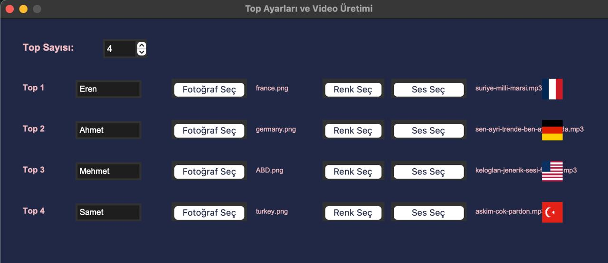

# 🎮 Ball Game Video Creator

<div align="center">


*Create stunning physics-based marble race videos with customizable obstacles and effects*

[🎬 Watch Demo Video](output/advanced_marble_race.mp4) • [📖 Documentation](#documentation) • [🚀 Quick Start](#installation)

</div>

---

## ✨ Features

### 🎯 Core Features
- **Realistic Physics Simulation** - Powered by Pymunk physics engine
- **Multiple Marble Support** - Up to 12 customizable marbles with unique properties
- **Dynamic Camera System** - Smooth camera tracking and auto-follow mechanics
- **Professional Video Export** - High-quality MP4 output with audio support
- **Real-time UI Overlay** - Live rankings, leader tracking, and game statistics

### 🎨 Customization Options
- **Personalized Marbles** - Custom names, photos, colors, and sound effects
- **Diverse Obstacle Set** - 15+ unique obstacles including force zones, bouncers, and gravity wells
- **Dynamic Backgrounds** - Gradient backgrounds with theme-based color schemes
- **Audio Integration** - Leader change sound effects and background music support

### 🎪 Obstacle Types
- 🔄 **Spinners & Windmills** - Rotating obstacles with momentum
- 💨 **Force Zones** - Directional push/pull areas with visual indicators
- 🌀 **Gravity Wells** - Attractive/repulsive force fields
- 📏 **Platforms & Bouncers** - Static and dynamic platforms
- 🎯 **Plinko & Pegs** - Pinball-style obstacles
- ⚡ **Conveyors & Hammers** - Moving and striking elements

---

## 🚀 Installation

### Prerequisites
- Python 3.8 or higher
- pip package manager

### Quick Setup
```bash
# Clone the repository
git clone https://github.com/ernakkc/ball-game-video-creator.git
cd ball-game-video-creator

# Install dependencies
pip install -r requirements.txt

# Run with UI (Recommended for beginners)
python main.py --ui

# Or run simulation directly
python main.py
```

### Windows Users
Double-click `run_with_ui.bat` for the easiest setup experience!

---

## 🎮 Usage

### GUI Mode (Recommended)
```bash
python main.py --ui
```
- **Ball Configuration**: Set names, photos, colors, and sounds for each marble
- **Visual Setup**: Preview marbles before simulation
- **One-Click Export**: Generate video with progress tracking

### Command Line Mode
```python
from core.game import Game
from levels.level_random import LevelRandom

# Initialize game
game = Game()
game.record_video = True

# Load level and run
game.load_level(LevelRandom)
results = game.run()

print(f"Generated {results['frame_count']} frames")
print(f"Video saved to: output/advanced_marble_race.mp4")
```

### Configuration
Edit `config/user_settings.py` to customize:
```python
NUM_MARBLES = 4          # Number of marbles (2-12)
NAMES = ['Alice', 'Bob', 'Charlie', 'Diana']  # Marble names
PHOTOS = ['alice.jpg', 'bob.jpg', ...]        # Profile photos
SOUNDS = ['alice.wav', 'bob.wav', ...]        # Voice effects
```

---

## 📁 Project Structure

```
ball-game-video-creator/
│
├── 🎯 main.py                 # Application entry point
├── 📋 requirements.txt        # Python dependencies
├── ⚙️ run_with_ui.bat         # Windows launcher
│
├── 🔧 config/
│   ├── settings.py           # Game constants & physics
│   └── user_settings.py      # User customization
│
├── 🎮 core/
│   ├── game.py              # Main game loop & logic
│   ├── world.py             # Physics world setup
│   ├── camera.py            # Camera tracking system
│   ├── renderer.py          # Graphics rendering
│   └── event_manager.py     # Input handling
│
├── 🎪 entities/
│   ├── ball.py              # Marble entity with physics
│   ├── particle.py          # Visual effects
│   ├── screen_text.py       # UI overlay system
│   └── base_entity.py       # Entity base class
│
├── 🏗️ obstacles/
│   ├── base_obstacle.py     # Obstacle framework
│   ├── force_zone.py        # Directional force fields
│   ├── bouncer.py           # Bouncing platforms
│   ├── gravity_well.py      # Gravity manipulation
│   └── [15+ more obstacles]
│
├── 🗺️ levels/
│   ├── level_base.py        # Level interface
│   ├── level_random.py      # Procedural generation
│   └── [custom levels]
│
├── 🎵 assets/
│   ├── photos/              # Marble profile images
│   ├── sounds/              # Audio effects
│   └── backgrounds/         # Theme assets
│
└── 🧰 utils/
    ├── color_utils.py       # Color manipulation
    ├── vec2px.py           # Coordinate conversion
    └── math_utils.py       # Mathematical helpers
```

---

## 🎬 Demo & Screenshots

### Video Demo
🎥 **Watch the full demo**: [output/advanced_marble_race.mp4](output/advanced_marble_race.mp4)

*Experience realistic physics, dynamic camera work, and professional video output!*

### Game Screenshots
<div align="center">

**Live Game View**


**UI Configuration**

</div>

---

## 🔧 Advanced Configuration

### Physics Settings (`config/settings.py`)
```python
SCREEN_WIDTH = 1200
SCREEN_HEIGHT = 800
FPS = 60
GRAVITY = (0, 900)          # Realistic gravity
FRICTION = 0.8             # Surface friction
ELASTICITY = 0.7           # Bounce factor
```

### Custom Obstacle Creation
```python
from obstacles.base_obstacle import BaseObstacle

class CustomObstacle(BaseObstacle):
    def __init__(self, space, x, y):
        super().__init__(space)
        # Your custom obstacle logic here
```

### Video Export Options
- **Resolution**: Configurable output size
- **Frame Rate**: 30/60 FPS options
- **Audio**: Background music + sound effects
- **Format**: MP4 with H.264 encoding

---

## 🤝 Contributing

We welcome contributions! Please see our [Contributing Guide](CONTRIBUTING.md) for details.

### Development Setup
```bash
# Fork and clone
git clone https://github.com/ernakkc/ball-game-video-creator.git
cd ball-game-video-creator

# Create virtual environment
python -m venv venv
source venv/bin/activate  # On Windows: venv\Scripts\activate

# Install dev dependencies
pip install -r requirements.txt
pip install flake8 black  # Code quality tools

# Run tests
python -m pytest
```

### Code Style
- Follow PEP 8 guidelines
- Use type hints where possible
- Add docstrings to functions and classes
- Keep commits atomic and descriptive

---

## 📄 License

This project is licensed under the MIT License - see the [LICENSE](LICENSE) file for details.

---

## 🙏 Acknowledgments

- **Pygame** - Game development framework
- **Pymunk** - 2D physics engine
- **MoviePy** - Video processing library
- **Python Community** - Amazing ecosystem

---

## 📞 Support

- 📧 **Email**: ern.akkc@gmail.com
- 🐛 **Issues**: [GitHub Issues](https://github.com/ernakkc/ball-game-video-creator/issues)
- 💬 **Discussions**: [GitHub Discussions](https://github.com/ernakkc/ball-game-video-creator/discussions)

---

<div align="center">

**Made with ❤️ using Python, Pygame & Pymunk**

⭐ Star this repo if you find it useful!

[⬆️ Back to Top](#-ball-game-video-creator)

</div>

